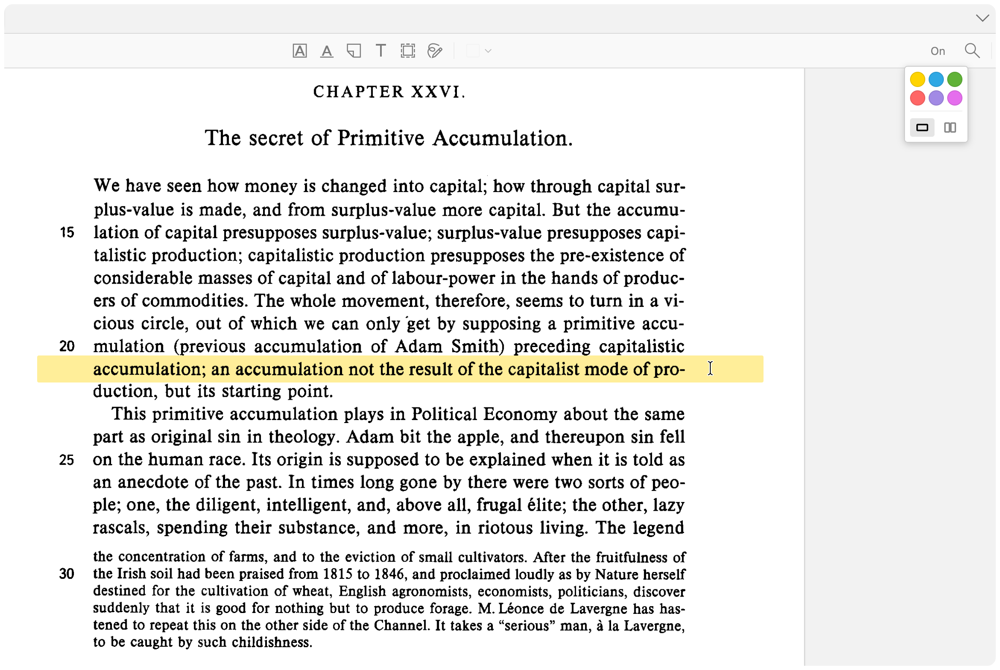
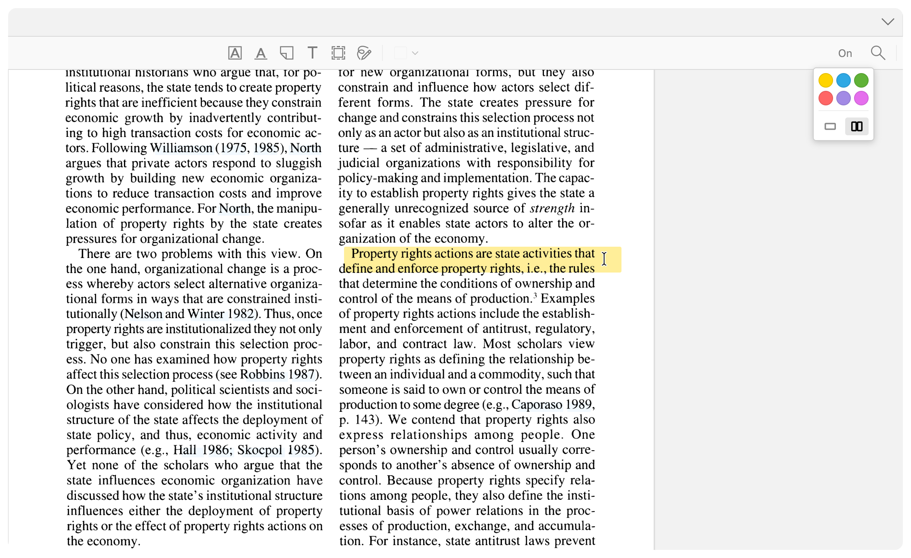

# Zotero Reading Guide 📖

A simple tool to help you focus when reading long papers. It adds a highlighter line that follows your mouse cursor, making it easier to track lines and stay focused.

## Features

- **Focus ruler:** A transparent colored line follows your mouse to guide your reading
- **2-column mode [beta]:** A mode to read two-column paper that snaps the guide to the text width (at least it that's what it is supposed to do)
- **Keyboard shortcuts:** Toggle the guide on/off and change the mode without using the UI
- **Custom colors:** Right-click the `Off/On` button to choose from standard highlighting colors (yellow, blue, green, etc.)

## How to use

1.  Open a PDF in Zotero
2.  Click the `Off` button in the toolbar to turn it on
3.  **Right-click** the button to change colors or switch to "column mode".

**Shortcuts:**

- `Alt + R` (`Option` + `R` on Mac): Toggle on/off
- `Alt + C` (`Option` + `C` on Mac): Toggle column mode

## Examples

_[Reading Guide: Full Width Paper]_

---

_[Reading Guide: 2-Column Paper]_

## Installation

1.  Download the latest `.xpi` file from the [releases page](https://github.com/d-nader/zotero-reading-guide/releases) (right-click and "Save as..." in Firefox)
2.  In Zotero, go to **Tools -> Plugins**.
3.  Click on the wheel and choose "Install Plugin From File" and select the `.xpi` file
4.  Restart Zotero

## Changelog

`v.0.1.0`: Initial release
